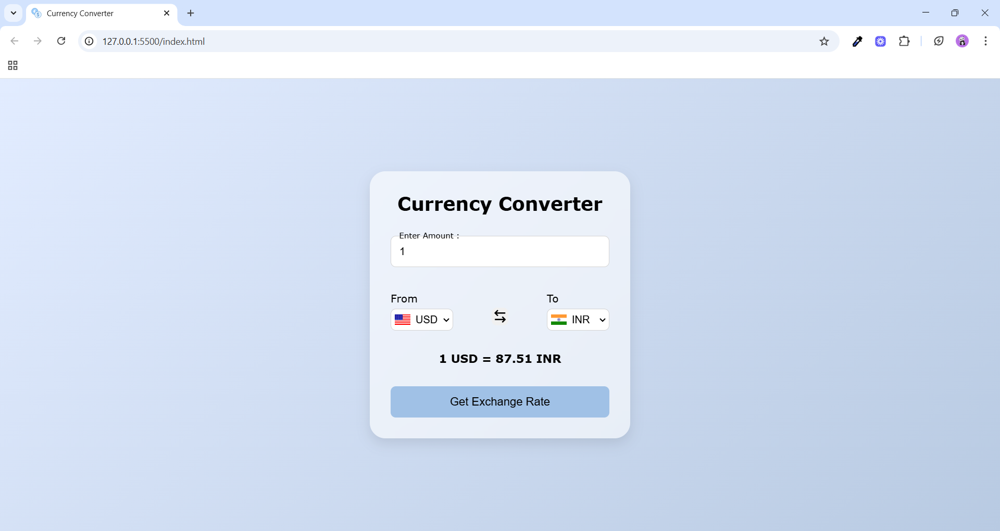

# 🌍 Currency Converter

A simple and modern **Currency Converter Web App** built with **HTML, CSS, and JavaScript**, using a **live exchange rate API**.  

---

## ✨ Features  

- 🔄 Convert between **100+ currencies** using live exchange rates  
- 🇺🇸 Dynamic **country flags** that update with currency selection  
- 🔃 **Swap currencies** with one click  
- 📱 **Responsive design** – works on desktop & mobile  
- ✅ Error handling for API failures  
- 🖋️ Modern UI with floating labels & smooth animations  

---

## 🖼️ Screenshot  

---

## 🛠️ Tech Stack  

- **HTML5** – structure  
- **CSS3** – styling & animations (glassmorphism + gradient background)  
- **JavaScript (ES6)** – dynamic functionality, API integration  
- **Currency API** – [@fawazahmed0/currency-api](https://github.com/fawazahmed0/currency-api) (via jsDelivr CDN)  
- **Flags API** – [flagsapi.com](https://flagsapi.com/) for country flags 

---